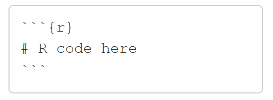
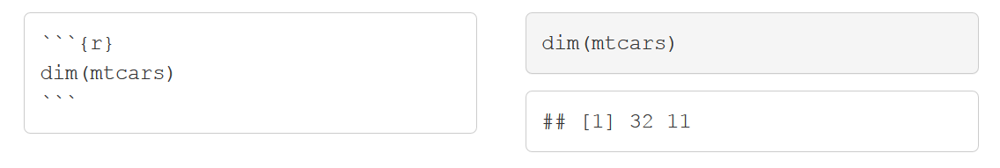
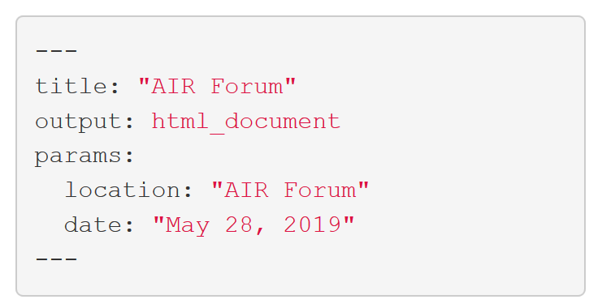

```{r setup, include=FALSE}
library(ggplot2)
library(magrittr)
knitr::opts_chunk$set(echo = FALSE, warning = FALSE, message = FALSE)
```

# R Markdown

.left-column[
Plain text file with 3 types of content:

- YAML header surrounded by `---`
- Text in markdown
- Code chunks surrounded by ```
]

.right-column[

]

---

# Why Should I Care?

.center[
### Old Path
]

.right-column[
.pull-left[
.center[
&nbsp;  
  
Query  

`r fontawesome::fa(name = "arrow-down", height = "24pt", fill = "black")`  

Analyze  

`r fontawesome::fa(name = "arrow-down", height = "24pt", fill = "black")`  

Graphics  

`r fontawesome::fa(name = "arrow-down", height = "24pt", fill = "black")`  

Report  
    ]
  ]
  
  
.pull-right[
.left[
    
    
    
  
    ]
  ]
]

.left-column[
Problems with method:
  * Time consuming
  * Copy/pasting (likelyhood of errors`r fontawesome::fa(name = "arrow-up", height = "16pt", fill = "#777")`)
  * Requires multiple staff/applications
]

---

# Most Important 

.pull-left[
[](https://bookdown.org/yihui/rmarkdown/)
]

.pull-right[[](https://www.rstudio.com/resources/cheatsheets/#rmarkdown)
]

---
# Reproducible Workflow using R Markdown

.left-column[
R Markdown Combines: 

* Prose 
* Code 
* Results 

Output formats:

* Web documents __`.html`__
* Static documents with LaTeX __`.pdf`__ 
* MS Word __`.docx`__ 
* Powerpoint __`.pptx`__
* EPUB __`.epub`__

]

.right-column[

.pull-left[

1. Text in markdown:  
 
  .center[Write \&#42;\&#42;what\&#42;\&#42; you want \&#42;however\&#42; you want]
  .center[`r fontawesome::fa(name = "arrow-down", height = "12pt", fill = "black")`] 
  .center[Write __what__ you want _however_ you want]  
 
2. Inline or Chunks of Code:  
  
  .center[Today's date is \&#96; `r knitr::inline_expr("Sys.Date()")`\&#96;]
  .center[`r fontawesome::fa(name = "arrow-down", height = "12pt", fill = "black")`] 
  .center[Today's date is `r Sys.Date()`]  
 
3. Figures (*Outputs*):
  .center[
 
```{r fig.height=1.5, fig.width=4}
ggplot(mtcars) +
  geom_histogram(aes(x = mpg)) +
  theme(axis.title.x = element_blank())
```
    ]
  ]
  
  .pull-right[
    
  ]
]

???

Reproducible documents: If error discovered, or if additional data, can just re-compile the report and get new or corrected results. Versus having to reconstruct figures and tables, paste them into a Word document, and further hand-edit various detailed results. **LITERATE PROGRAMMING**
---

# PDF

  .pull-left[
    
  ]
  
  .pull-right[
    
  ]

???

---

# HTML Documents

  

---

# Word Documents

  

---

# Presentations

  

---

# Dashboards

  

---

# Tutorials

  

---

# Books

  .left-column[
    [
      
    ](https://bookdown.org/yihui/bookdown/)
  ]

  .right-column[
    
  ]

---

# Blogs

  .left-column[[](https://bookdown.org/yihui/blogdown/)]

  .right-column[[](https://alison.rbind.io/post/2017-06-12-up-and-running-with-blogdown/)]

---

# Paged HTML Documents 

.left-column[

Paginated HTML with R Markdown:   [pagedown](https://github.com/rstudio/pagedown)  

Current templates include [JSS article, CV, letter, business cards](https://pagedown.rbind.io/#applications)
]
.right-column[
  .pull-left[
    
  ]
  .pull-right[
    
  ]
] 

???

Uses Paged.js polyfill to implement CSS support 
R Markdown document, means all the advantages are available
Most stable in Chrome browser
Customizable using HTML/CSS:
 - add university design
 - work with marketing dept/webmaster
 - Combine the content creation and styling
 - Perfect for reports where styling does not change a lot (annual reports)

---
class: middle, center

# R Markdown

---
layout:true
class: middle, left
---

# Headers


---

# Text


---

# Lists


---

# Hyperlinks


---

# Images


---

# Math Expressions


---

# Math Equations


---
class: middle, center

# Code

---

# Inline

Place code within a sentence with ` `r knitr::inline_expr("*code here*")` `. R Markdown will replace the code with its results.

For example, ` `r knitr::inline_expr("87 + 78")` ` will evaluate to `r 87 + 78`

---
# Chunks

Insert a "chunk" of R code using backticks and braces.



When the report is rendered, R Markdown will evaluate the code and include the results, while also removing the backticks and braces.

Shortcut to Insert Chunk:

* **Ctrl + Alt + I** (PC)
* **Cmd + Option + I** (Mac)

---

# Chunk Options



---

# echo = FALSE


---

# eval = FALSE


---

# include = FALSE


---

# fig.height/fig.width


---

# How it Works

  .center[]
  
---
class: middle, center

# Parameterized
  
---

# YAML

.pull-left[

]

.pull-right[

]
  
---

# Parameters


  
---

# Using Parameters

```yaml
---
params:
  location: Southern Brewing
  date: !r format(Sys.Date(), "%B %d, %Y")
---

Welcome to this workshop, given at `r knitr::inline_expr("params$location")` on `r knitr::inline_expr("params$date")`.
```

.center[`r fontawesome::fa(name = "arrow-down", height = "26pt", fill = "black")`]

Welcome to this workshop, given at `r params$location` on `r params$date`.
  
---

# render()

Render at the command line with the default YAML options

```{r, echo=TRUE, eval=FALSE}
library(rmarkdown)
render("my-presentation.Rmd")
```

Render at the command line with set parameters

```{r, echo=TRUE, eval=FALSE}
library(rmarkdown)
render("my-presentation.Rmd",
       params = list(location = "USF",
                     date = "August 5, 2019"))
```

---

# Things to Remember

1. Document is ran in a fresh R session using knitr, therefore all libraries used should be loaded *within the document*
2. Objects created in a code chunk are available to code in later chunks
  
---

# Knitr is MULTI-Lingual

* SQL
* Python
* SAS
* [Many more](https://bookdown.org/yihui/rmarkdown/language-engines.html)
  
---

# engine


  
---

# Note for SAS


---

# Resources 

.pull-left[
[](https://bookdown.org/yihui/rmarkdown/)
]

.pull-right[[](https://www.rstudio.com/resources/cheatsheets/#rmarkdown)
]

---
class: center, middle
# Reproducibility

Everything is text so can take advantage through:
- Copy/pasting code errors into search engines
- Version contol (git)
- Portability (minimal file size)

---
class: center, middle
# Questions?
